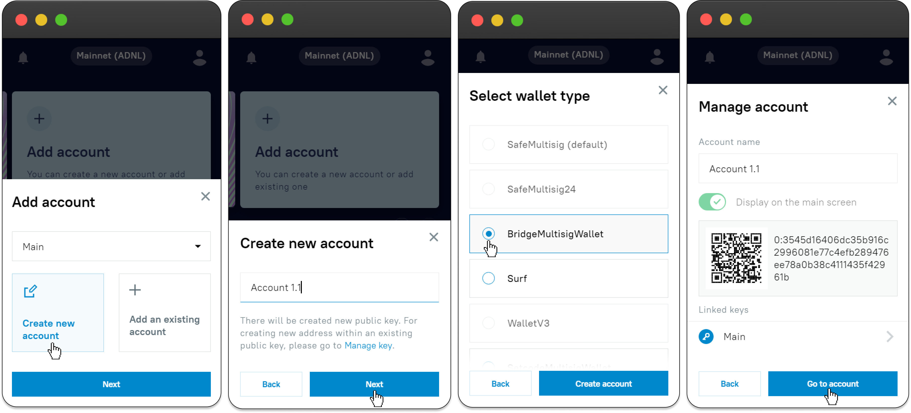

# EVER Walletの拡張機能

**プロフィールメニュー**に移動し、［**シードとアカウントを管理**］をクリックします。\
アカウントは鍵に、鍵はシードにリンクしているため、希望のシードと鍵をクリックして選択し、**アカウント管理メニュー**に移動します。

.png>)

## 追加されたアカウント管理

アカウント一覧で、1つクリックすると、**アカウント管理メニュー**が表示されます。\
こちらでは下記が行えます:

* 表示名(アカウント名)の変更。&#x20;
* EVER Wallet拡張機能のメインページでのアカウント表示の有効化または無効化。
* アカウントのアドレスとQRコードをコピーし、アカウントがどの鍵とリンクしているかを表示。

.png>)

## 新しいアカウントを追加する

鍵にリンクしているアカウント一覧の上部にある\[**+新規追加**]をクリックしてアカウントをリンクさせます（または、アカウントカードを切り替えてEVER Walletのメイン画面にアカウントを追加することでリンクさせます）。

.png>)

### 新しく作成する

1. ［**新しいアカウントを作成する**］を選択します。
2. 新しいアカウントの表示名を入力します。
3. ウォレットタイプを選択します。それぞれの鍵に対して、各タイプのウォレットを1つ作成できることに注意してください。
4. これで、このアカウントのカードに移動できます。(アカウントへ移動する)

### 既存を追加する

1. ［**既存のアカウントを追加する**］を選択します。
2. アカウントの**表示名**を入力します。
3. **マルチシグアドレス**を入力します。
4. ［**アカウントを追加する**］をクリックします。

.png>)
